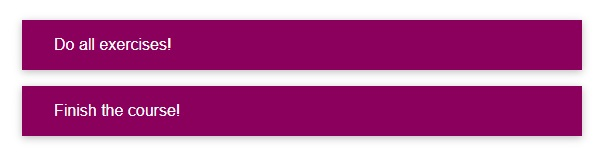
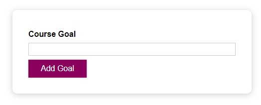
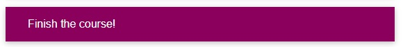
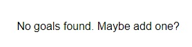

# To Do List

This is a web app which helps you to add/remove/view your daily tasks.

## React/JS Topics covered

Following React/JS topics are covered in this web app - 

- Reusable functional components
- useState Hook
- Functions as props
- Reusable UI components
- Inline css/ style prop
- Spread operator
- Array/ object destructuring
- Event handling
- Array filter()/ map()
- Conditional rendering
- Forms
- Two way binding
- Children prop

## Features
Following features are available in this web app - 

### 1. Main page/ fetch-tasks page
This page allows you to fetch your to-do-list.
 

### 2. Add to-do
Here, you can add new to-do.
 

### 3. Remove to-do
By clicking on a particular to-do, you can remove it.
 

### 4. Fallback page
This page is shown if there is no to-do in your list.
 
